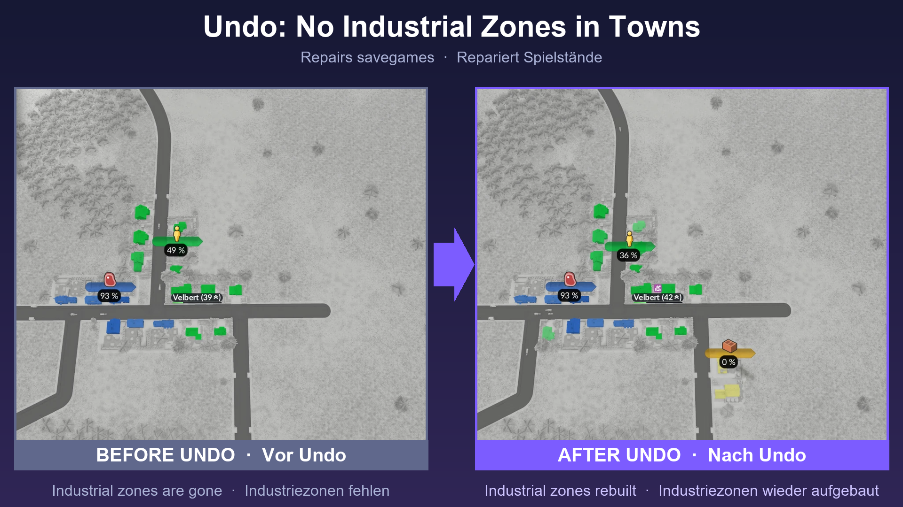

# Towns Without Industrial Zones (Transport Fever 3)

**EN** | [DE](#deutsch)

A script mod for Transport Fever 3. Towns no longer build industrial zones, and existing industrial buildings inside towns are removed. Automatic industry spawning is switched off as well.

**Please test it in a new game or on a copy of your savegame first, and tell me how it works for you** (see [Feedback](#feedback)).

## Why

When a town grows, the game spreads the new capacity over residential, commercial and industrial districts, even over districts you do not supply. As a result, industrial buildings can appear in towns whose industry you never serve. This mod sets the industrial district of every town to zero.

## What to expect

- Industrial buildings inside towns are removed as soon as the mod is active, also in a savegame you add it to.
- Industries outside of towns (mines, farms, factories) are not touched.
- Residential and commercial districts keep growing. Commercial can still receive a small share of the growth.
- Automatic spawning of new industries is off (`economy.industryDevelopment.spawnIndustries = false`).

## How it works

- `content/no_town_industry_growth.gs.lua` and `.script.tl`: a game script that sets the industrial initial land-use capacity of every town to 0 (`makeTownSetInitialLandUseCapacitiesCmd`).
- `content/mod.script.tl`: `preRunFn` disables industry spawning.

## Install

Copy the folder `no_town_industry_zones` into the mods folder of your game, or load it through the in-game mod hub if it is published there. Start a new game and activate the mod when you create it.

## Important limitation

The mod sets the industrial capacity of every town to zero **permanently in the savegame**. **Do not remove the mod from a savegame you played with it**: without the mod, the game's industry logic finds no industrial demand and crashes within minutes (`GetTargetIndustriesCounts`, `maxNeeded > 0`). The savegame saved at the crash cannot be started without the Undo mod, but it can be loaded with it; or use the last autosave from before. Never remove the mod without switching directly to the Undo mod (see below). Try it on a copy first.

## Undo mod (repair a savegame)

If you already removed the mod from a savegame and the game crashes, use `undo_no_town_industry_zones` ("Undo: Towns Without Industrial Zones"). It restores the industrial capacity of the towns and rebuilds the industrial zones in their initial size.

1. Load the savegame, deactivate "Towns Without Industrial Zones" and activate the Undo mod.
2. Let the game run for about a minute. Do not pause.
3. Save the game.
4. Load it without the Undo mod. Everything runs normal again.

Never use both mods together.

## Tested

Tested on Transport Fever 3, build 40408: new game, saving, quitting and loading again, more than 30 minutes of play without errors. Undo mod: a savegame that crashed without the main mod ran for more than 10 minutes without errors after the repair (industrial buildings were rebuilt within seconds in all 13 towns of the test savegame).

Not tested: adding the mod to an old savegame that already has industrial zones, and the combination with other mods that change town growth.

## Feedback

Please use [Issues](../../issues) for bugs and [Discussions](../../discussions) for feedback and ideas. Helpful details: game build, other active mods, what you did before, and the `stdout.txt` from your `crash_dump` folder if the game crashed.

## License

MIT, see [LICENSE](LICENSE).

---

## Deutsch

Ein Script-Mod für Transport Fever 3. Städte bauen keine Industriezonen mehr, und bestehende Industriegebäude in Städten werden entfernt. Das automatische Entstehen neuer Industrien ist ebenfalls abgeschaltet.

**Bitte zuerst in einem neuen Spiel oder mit einer Kopie deines Spielstands testen und mir Rückmeldung geben** (siehe [Feedback](#feedback-1)).

### Warum

Wächst eine Stadt, verteilt das Spiel die neue Kapazität auf Wohn-, Gewerbe- und Industriezone, auch auf Zonen, die du nicht versorgst. So können Industriegebäude in Städten entstehen, deren Industrie du nie bedienst. Der Mod setzt die Industriezone jeder Stadt auf null.

### Was du erwarten kannst

- Industriegebäude in Städten werden entfernt, sobald der Mod aktiv ist, auch in einem Spielstand, in den du ihn nachträglich einbindest.
- Industrien außerhalb von Städten (Minen, Farmen, Fabriken) bleiben unberührt.
- Wohn- und Gewerbezone wachsen weiter. Gewerbe kann weiterhin einen kleinen Anteil am Wachstum bekommen.
- Das automatische Entstehen neuer Industrien ist aus (`economy.industryDevelopment.spawnIndustries = false`).

### Installation

Den Ordner `no_town_industry_zones` in den Mods-Ordner des Spiels kopieren oder über den Modhub im Spiel laden, falls er dort veröffentlicht ist. Ein neues Spiel starten und den Mod beim Anlegen aktivieren.

### Wichtige Einschränkung

Der Mod setzt die Industriekapazität jeder Stadt **dauerhaft im Spielstand** auf null. **Entferne den Mod nie aus einem Spielstand, den du damit gespielt hast**: Ohne den Mod findet die Industrie-Logik des Spiels keinen Industriebedarf und stürzt nach wenigen Minuten ab (`GetTargetIndustriesCounts`, `maxNeeded > 0`). Der beim Absturz gespeicherte Spielstand lässt sich ohne den Undo-Mod nicht starten, mit ihm aber laden; oder nimm den letzten Autosave von davor. Entferne den Mod nie, ohne direkt zum Undo-Mod zu wechseln (siehe unten). Probiere ihn zuerst an einer Kopie aus.

### Undo-Mod (Spielstand reparieren)

Hast du den Mod schon aus einem Spielstand entfernt und das Spiel stürzt ab, nutze `undo_no_town_industry_zones` („Undo: Towns Without Industrial Zones“). Er stellt die Industriekapazität der Städte wieder her und baut die Industriezonen in der Anfangsgröße neu auf.

1. Spielstand laden, „Towns Without Industrial Zones“ deaktivieren und den Undo-Mod aktivieren.
2. Das Spiel etwa eine Minute laufen lassen. Nicht pausieren.
3. Spiel speichern.
4. Den Spielstand ohne den Undo-Mod laden. Alles läuft wieder normal.

Nie beide Mods zusammen verwenden.

### Getestet

Getestet mit Transport Fever 3, Build 40408: neues Spiel, Speichern, Beenden und Neuladen, über 30 Minuten Spielzeit ohne Fehler. Undo-Mod: Ein Spielstand, der ohne den Haupt-Mod abstürzte, lief nach der Reparatur über 10 Minuten ohne Fehler (die Industriegebäude wurden in allen 13 Städten des Testspielstands innerhalb von Sekunden neu aufgebaut).

Nicht getestet: den Mod in einen alten Spielstand mit bestehenden Industriezonen einbinden, und die Kombination mit anderen Mods, die das Stadtwachstum verändern.

### Feedback

Bitte [Issues](../../issues) für Fehler und [Discussions](../../discussions) für Rückmeldungen und Ideen nutzen. Hilfreich sind: Spiel-Build, andere aktive Mods, was du kurz vorher getan hast, und die `stdout.txt` aus dem Ordner `crash_dump`, falls das Spiel abgestürzt ist.

### Lizenz

MIT, siehe [LICENSE](LICENSE).
