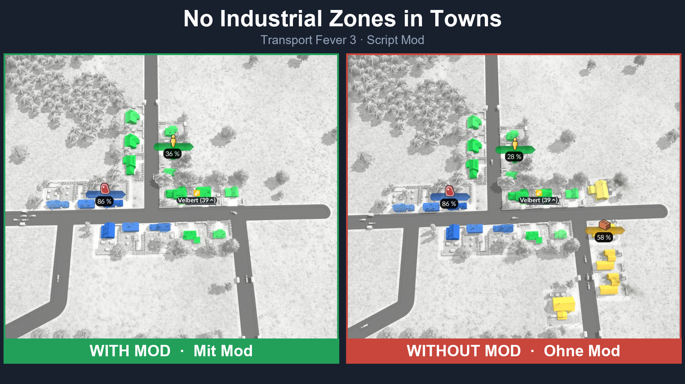

# No Industrial Zones in Towns (Transport Fever 3)

**EN** | [DE](#deutsch)

A script mod for Transport Fever 3. Towns no longer build industrial zones, and existing industrial buildings inside towns are removed. Automatic industry spawning is switched off as well.

**Please test it in a new game or on a copy of your savegame first, and tell me how it works for you** (see [Feedback](#feedback)).

## Why

When a town grows, the game spreads the new capacity over residential, commercial and industrial districts, even over districts you do not supply. As a result, industrial buildings can appear in towns whose industry you never serve. This mod sets the industrial district of every town to zero.

## What to expect

- Industrial buildings inside towns are removed as soon as the mod is active, also in a savegame you add it to.
- Industries outside of towns (mines, farms, factories) are not touched.
- Residential and commercial districts keep growing. Commercial can still receive a small share of the growth.
- Automatic spawning of new industries is off (`economy.industryDevelopment.spawnIndustries = false`).

## How it works

- `content/no_town_industry_growth.gs.lua` and `.script.tl`: a game script that sets the industrial initial land-use capacity of every town to 0 (`makeTownSetInitialLandUseCapacitiesCmd`).
- `content/mod.script.tl`: `preRunFn` disables industry spawning.

## Install

Copy the folder `no_town_industry_zones` into the mods folder of your game, or load it through the in-game mod hub if it is published there. Start a new game and activate the mod when you create it.

## Tested

Tested on Transport Fever 3, build 40408: new game, saving, quitting and loading again, more than 30 minutes of play without errors.

Not tested: adding the mod to an old savegame that already has industrial zones, and the combination with other mods that change town growth.

## Feedback

Please use [Issues](../../issues) for bugs and [Discussions](../../discussions) for feedback and ideas. Helpful details: game build, other active mods, what you did before, and the `stdout.txt` from your `crash_dump` folder if the game crashed.

## License

MIT, see [LICENSE](LICENSE).

---

## Deutsch

Ein Script-Mod für Transport Fever 3. Städte bauen keine Industriezonen mehr, und bestehende Industriegebäude in Städten werden entfernt. Das automatische Entstehen neuer Industrien ist ebenfalls abgeschaltet.

**Bitte zuerst in einem neuen Spiel oder mit einer Kopie deines Spielstands testen und mir Rückmeldung geben** (siehe [Feedback](#feedback-1)).

### Warum

Wächst eine Stadt, verteilt das Spiel die neue Kapazität auf Wohn-, Gewerbe- und Industriezone, auch auf Zonen, die du nicht versorgst. So können Industriegebäude in Städten entstehen, deren Industrie du nie bedienst. Der Mod setzt die Industriezone jeder Stadt auf null.

### Was du erwarten kannst

- Industriegebäude in Städten werden entfernt, sobald der Mod aktiv ist, auch in einem Spielstand, in den du ihn nachträglich einbindest.
- Industrien außerhalb von Städten (Minen, Farmen, Fabriken) bleiben unberührt.
- Wohn- und Gewerbezone wachsen weiter. Gewerbe kann weiterhin einen kleinen Anteil am Wachstum bekommen.
- Das automatische Entstehen neuer Industrien ist aus (`economy.industryDevelopment.spawnIndustries = false`).

### Installation

Den Ordner `no_town_industry_zones` in den Mods-Ordner des Spiels kopieren oder über den Modhub im Spiel laden, falls er dort veröffentlicht ist. Ein neues Spiel starten und den Mod beim Anlegen aktivieren.

### Getestet

Getestet mit Transport Fever 3, Build 40408: neues Spiel, Speichern, Beenden und Neuladen, über 30 Minuten Spielzeit ohne Fehler.

Nicht getestet: den Mod in einen alten Spielstand mit bestehenden Industriezonen einbinden, und die Kombination mit anderen Mods, die das Stadtwachstum verändern.

### Feedback

Bitte [Issues](../../issues) für Fehler und [Discussions](../../discussions) für Rückmeldungen und Ideen nutzen. Hilfreich sind: Spiel-Build, andere aktive Mods, was du kurz vorher getan hast, und die `stdout.txt` aus dem Ordner `crash_dump`, falls das Spiel abgestürzt ist.

### Lizenz

MIT, siehe [LICENSE](LICENSE).
